## Tabla de contenido
- [Tabla de contenido](#tabla-de-contenido)
- [Introducción](#introducción)
- [Videojuegos, el séptimo arte](#videojuegos-el-séptimo-arte)
- [Game engines (motores de juego)](#game-engines-motores-de-juego)
- [Licenciamiento](#licenciamiento)
- [Instalación de Unity](#instalación-de-unity)
- [Opciones de Unity Hub](#opciones-de-unity-hub)
- [Projects (proyectos)](#projects-proyectos)
- [Installs (instalaciones)](#installs-instalaciones)
- [Learn (Aprendizaje)](#learn-aprendizaje)
- [Community (comunidad)](#community-comunidad)
- [Instalación](#instalación)
- [Interfaz del editor](#interfaz-del-editor)
- [Crear un GAMEOBJECT](#crear-un-gameobject)
- [Componente TRANSFORM](#componente-transform)
- [Nombre de objetos y Emparentamiento](#nombre-de-objetos-y-emparentamiento)
- [Navegación en la escena](#navegación-en-la-escena)
- [Reto de la semana](#reto-de-la-semana)
- [Rescatando lo importante](#rescatando-lo-importante)

Introducción
-------------------
Antes de comenzar con nuestro viaje en la magia que hace posibles los videojuegos, me permito darte la bienvenida a este Bootcamp; es un regocijo ver cada vez a más colegas amantes del género, con gran curiosidad y avidez del conocimiento para ser parte de esta industria.

Los videojuegos han evolucionado de ser solo un medio de entretenimiento a proveer soluciones para diferentes sectores, como la medicina, la arquitectura, la industria automovilística, la mercadotecnia y muchos otros.

Una de las grandes virtudes de los videojuegos es la capacidad de expresar, de hacernos sentir parte de una historia, de un equipo, de un resultado. Te doy la bienvenida a esta gran comunidad. Vamos juntos a dar un salto de fe; tengamos el valor de tomar el cincel y el martillo para crear obras maestras.

En este módulo vamos a desentrañar las siguientes incógnitas:

*   ¿Cómo es que se realizan los juegos e interactivos que tanto amamos?
*   ¿Cómo hemos evolucionado en el mundo del desarrollo de los videojuegos?
*   Y, más importante aún, ¿qué herramientas están a la vanguardia?
*   ¿Por qué Unity es mi gran aliado en esta aventura?

Sin más preámbulo, vamos a comenzar, let’s go.

Videojuegos, el séptimo arte
-------------------

Bien dice el dicho: “quien no conoce su historia está condenado a repetirla”, y como en muchas otras áreas, en el mundo del desarrollo de videojuegos tenemos una gran historia.

Alguna vez te has preguntado **¿Cuáles fueron los primeros videojuegos?**

Es probable que no los conozcas, pero estos juegos inspiraron a quienes hoy en día hacen los juegos más grandes, que amamos tanto; incluso inspiraron a otras áreas a pensar que el desarrollo de videojuegos tenía potencial para crear simuladores, interactivos, realidad virtual, etcétera.

A continuación tenemos algunos pininos en el tema:

1.  [Nim](https://www.google.com/url?q=https://www.archimedes-lab.org/game_nim/nim.html&sa=D&source=editors&ust=1667515659997574&usg=AOvVaw3UthL2-kjHVCapkyzTJuKG) [(1940](https://www.google.com/url?q=https://www.archimedes-lab.org/game_nim/nim.html&sa=D&source=editors&ust=1667515659998036&usg=AOvVaw39-E0Qmr-8va_ALqA_zLFR))

    - Un juego que pone a dos jugadores (una computadora y una persona) a elegir y sacar cerillos; es necesario un análisis matemático para elegir bien, y quien tome el último pierde.
    - En [este enlace](https://www.google.com/url?q=https://patents.google.com/patent/US2215544&sa=D&source=editors&ust=1667515659999256&usg=AOvVaw2Jez9_pVqO88J-0Xp1H02g) puedes ver el plano original de la máquina que se necesitaba para este juego. **Máquinas de tamaños inconcebibles** hoy en día para un solo juego.

2.  [Pong](https://www.google.com/url?q=https://www.youtube.com/watch?v%3DfiShX2pTz9A%26ab_channel%3Dandys-arcade&sa=D&source=editors&ust=1667515660000559&usg=AOvVaw1L7D100Nz7JWNWaz6_L10E) [(1972](https://www.google.com/url?q=https://www.youtube.com/watch?v%3DfiShX2pTz9A%26ab_channel%3Dandys-arcade&sa=D&source=editors&ust=1667515660000970&usg=AOvVaw0RGnerpmw-_Adv_ht3EEZv))
    - 32 años y mucho avance, sobre todo en el hardware, se requerían para hacer funcionar los juegos. **Atari** lanza al mercado el juego de Pong, un simulador de juego de pimpón para dos jugadores.
    - Tres años más tarde, Atari lanza la primera consola, una versión casera de Pong. En esta versión solo se podía jugar Pong y no era de cartuchos intercambiables.
     - Aquí comienza la acción de grandes compañías queriendo hacer sus propias máquinas de arcade y caseras para competir en el mercado.

3.  [Space invaders](https://www.google.com/url?q=https://youtu.be/MU4psw3ccUI?t%3D15&sa=D&source=editors&ust=1667515660003457&usg=AOvVaw2_kYeOyq0P84VymXBDL_xB) [(1978](https://www.google.com/url?q=https://youtu.be/MU4psw3ccUI?t%3D15&sa=D&source=editors&ust=1667515660003898&usg=AOvVaw0hBDv4WALcX41UFzxsRH9J))

    - El juego que hizo que todo el mundo perdiera la cabeza, el juego que comenzó la revolución de las máquinas arcade y a ver a los juegos con ánimo de competencia entre amigos.
    - Incluso, se dice que Space Invaders causó que hubiera escasez de monedas, debido a la popularidad del juego.

4.  [Pacman](https://www.google.com/url?q=https://www.youtube.com/watch?v%3DdScq4P5gn4A%26ab_channel%3DOldClassicRetroGaming&sa=D&source=editors&ust=1667515660005541&usg=AOvVaw2TN46KxZkJBDwN-xqyXpLv) [(1980](https://www.google.com/url?q=https://www.youtube.com/watch?v%3DdScq4P5gn4A%26ab_channel%3DOldClassicRetroGaming&sa=D&source=editors&ust=1667515660005948&usg=AOvVaw3mrfbfcTLEaRWp6BUUnHrk))

    - 40 años después de Nim, llega Pacman, uno de los primeros personajes entrañables, recordados y usados hasta nuestros días.
    - Seguimos usando maquinarias de tipo arcade para jugar. El desarrollo de estos juegos se sigue haciendo por medio de circuitos, con programas creados mediante compuertas lógicas y circuitos electrónicos.
    - Solo ingenieros muy hábiles tenían la capacidad de entender y crear este tipo de juegos, además de que las herramientas requeridas para hacerlos no estaban al alcance de la población en general. Normalmente eran desarrollados por los gigantes, como Atari, o por estudiantes con acceso a material y equipo en las universidades.

5.  [The legend of Zelda](https://www.google.com/url?q=https://www.youtube.com/watch?v%3D6g2vk8Gudqs%26ab_channel%3DYTSunny&sa=D&source=editors&ust=1667515660007911&usg=AOvVaw2OlqU7v_pv7Ldq1Gfch642) [(1987](https://www.google.com/url?q=https://www.youtube.com/watch?v%3D6g2vk8Gudqs%26ab_channel%3DYTSunny&sa=D&source=editors&ust=1667515660008203&usg=AOvVaw2f3gqN1YmwUeTkl6l8n4Zy))

    - El primer juego de Zelda, que no es el primer juego (si eres fan, seguramente sabes esto; si no, es más complicado de explicar), es mucho más fácil para aprender Unity (guiño, guiño). (En este enlace [puedes ver la cronología real y explicada](https://www.google.com/url?q=https://www.youtube.com/watch?v%3DNBUbdDv8xos%26t%3D686s%26ab_channel%3DEurogamerspain&sa=D&source=editors&ust=1667515660008723&usg=AOvVaw0wFtLDzeVkrPgJ78nJ7mBB)).
    - Este juego fue lanzado para la consola Nintendo Entertainment System (NES), salida en 1985.
    - **Pero ¿qué tiene esto que ver con Unity?**
    - Es aquí donde comienza la magia, donde la industria empieza a voltear a ver y buscar herramientas de desarrollo, puesto que ya no es necesaria una máquina específica para correr los juegos, si no que ahora existen consolas (muy pronto, computadores en todos los hogares) en las que solo se requiere hacer el programa y que estas lo interpreten.

6.  [Star Fox](https://www.google.com/url?q=https://www.youtube.com/watch?v%3DZnmnpWKoUS0%26ab_channel%3DEspaciodejuegos&sa=D&source=editors&ust=1667515660009881&usg=AOvVaw0OIqw_6ST7YNxaXlXZ2vC5) [(1993](https://www.google.com/url?q=https://www.youtube.com/watch?v%3DZnmnpWKoUS0%26ab_channel%3DEspaciodejuegos&sa=D&source=editors&ust=1667515660010113&usg=AOvVaw0Mnb4kvC308_Sw80O_VbiE))

    - El primer juego de Star Fox, otra de las sagas más entrañables de Nintendo, también se creó para la consola NES, y en este caso es un referente en la innovación, pues haciendo uso del chip Super FX fue el primer videojuego en traer y en quedarse en las páginas de la historia por hacer uso del espacio tridimensional.
    - Al traer el espacio tridimensional a los juegos, es el valiente que resuelve cómo manejar matemáticamente este espacio, por medio de ecuaciones y matrices, para traer a la mesa algo más divertido e interesante.

En el siguiente recurso se ofrece más información acerca de la historia de la que hemos sido parte:

>[The Strong National Museum of Play](https://www.google.com/url?q=https://www.museumofplay.org/video_games/&sa=D&source=editors&ust=1667515660012104&usg=AOvVaw2Ie31mYsh9eWkE9yk12xcv)

En más de 80 años de historia, los videojuegos han pasado por una gran evolución, que nos permite hoy en día disfrutar de grandes títulos y, a su vez, tener a la mano la oportunidad de ser parte de aquellos que crean la magia.

Game engines (motores de juego)
-------------------
Alguna vez te has preguntado **cómo sacan juegos de FIFA cada año.** Esa pregunta es clave, aunque el juego tal vez no tanto; eso depende de ti.

Cuando el mercado comenzó a crecer tanto, la velocidad de creación se convirtió en un elemento clave en la industria; muy pronto, algunas compañías empezaron a crear sus propios motores de juegos y programas de software muy especializados, que les servían para agilizar muchísimo su desarrollo y no tener que hacer de cero siempre todas las cosas; tal es el caso de Mario.

**¿Alguna vez has jugado Mario Maker?**

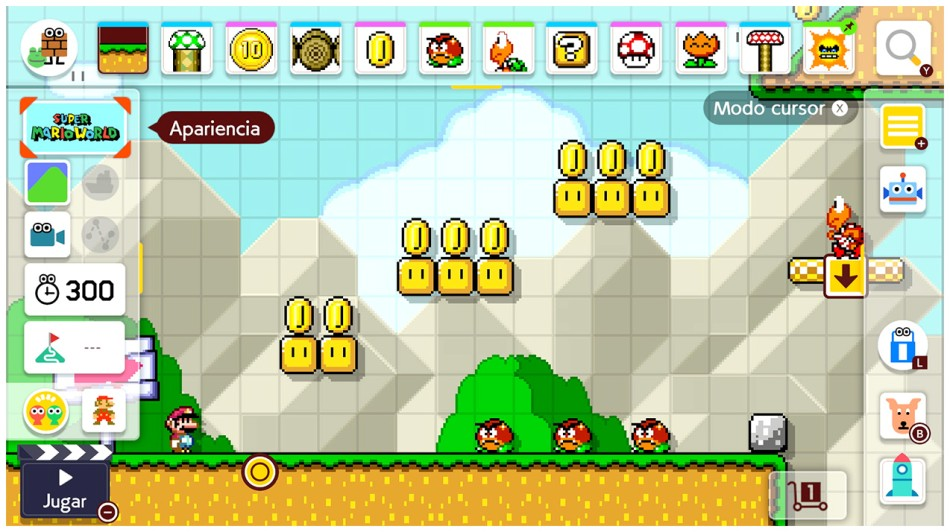

Este juego es perfecto para explicar qué debe hacer un motor de juegos; en este caso, el juego, que es más bien un programa, permite al usuario crear niveles de Mario, al darle todos los assets que necesite, con funciones específicas, para que cada jugador pueda crear su propio nivel de Mario.

Este tipo de herramientas es muy útil, pero hay un problema, solo sirve para hacer juegos de Mario. Nintendo lanzó recientemente el juego [Game Builder Garage](https://www.google.com/url?q=https://www.nintendo.com/store/products/game-builder-garage-switch/&sa=D&source=editors&ust=1667515660015175&usg=AOvVaw1wxV4tip4tk97YpqWeuQKg) para Nintendo Switch, en el cual puedes aprender a prototipar y crear juegos; problema solucionado. Ahora, otro problema: con esas herramientas no podemos monetizar nuestro juego, lanzarlo en diferentes plataformas, cargar nuestros propios assets o tener el control total para crear cosas personalizadas.

Y así pasamos de juegos muy buenos para el aprendizaje a tener que usar herramientas más profesionales, herramientas que se usan en el día a día de grandes compañías para desarrollar sus propios juegos y hacer las cosas increíbles que tanto amamos.

Un motor de juegos es un punto de convergencia de todos los aspectos involucrados en la creación de un juego.

Ahora que entendemos que es un game engine, nos toca hablar de quienes son los jugadores que hay en la mesa de los grandes, en este caso tenemos a:

-   Unity
    *   Es uno de los motores de juego más populares hoy en día. Desde hace algunos años, Unity tiene entre su catálogo de clientes a algunas de las empresas más grandes de todo el mundo, que desarrollan títulos como los siguientes:
        *   Genshin Impact.
        *   Cuphead.
        *   Pokemon Go.
        *   Beat saber.
        *   Fall Guys.
        *   Ruined King.

    *   Se ha popularizado en [diferentes industrias](https://www.google.com/url?q=https://unity.com/solutions&sa=D&source=editors&ust=1667515660018696&usg=AOvVaw29bXOgBpfOJO-hXorJf5VR):
        *   Videojuegos.
        *   Cinematográfica y animación.
        *   Arquitectura.
        *   Aeroespacial.
- Unreal
    *   Es el motor punta de lanza en cuanto a calidad gráfica. Cuenta con su estudio propio de juegos, donde despliega el potencial de su motor. Han hecho algunos juegos, como:
    *   Fortnite.
    *   Rocket League.
    *   Gears of War.
    *   Final Fantasy VII Remake.

- CryEngine
    *   Es un motor poderoso, que causó mucho revuelo cuando salieron los juegos de Crysis. Tiene un potencial gráfico del nivel de los más grandes, y tiene juegos como:
        *   Evolve.
        *   Crysis.
        *   Star Citizen.

Existen muchos más, pero vamos a quedarnos con estos tres, cuyas características permiten un desarrollo a la medida, multiplataforma y con liderazgo en el mercado.

La pregunta clave es ¿por qué escogemos Unity?

Este es un momento perfecto para reflexionar cuáles son las características que hacen a Unity más sobresaliente de entre los demás, sobre todo Unreal Engine, que es el competidor más importante en esta batalla.

Pues si todavía no lo sabes o no estás convencido, permíteme indicar por qué Unity es el mejor lugar para empezar y por qué podría ser una gran herramienta que llegó para quedarse.

*   La característica estandarte de Unity es que es una herramienta que funciona en tiempo real; esto significa que no necesitamos esperar una compilación, un despliegue o un render para poder ver lo que estamos haciendo, sino que podemos ver en tiempo real el efecto de nuestro trabajo.
*   Es uno de los motores que se popularizó bastante gracias a su característica de desarrollo **multiplataforma**.

*   Seguramente te imaginas que es muy complicado hacer un juego para computadora, pero hacerlo para Playstation, Nintendo Switch, Xbox, etcétera. Cada plataforma tiene sus particularidades, y Unity es un referente en lo que a multiplataforma se refiere, y se esfuerza en extender esa popularidad, integrando siempre las herramientas más novedosas e incluso dando oportunidad de usar **realidad virtual, realidad aumentada, interfaces hápticas**, sensores 3D, entre otros.

*   Es muy importante para iniciarse en el desarrollo que la herramienta sea sencilla de aprender. Es conocido que otros motores tienen un nivel mucho más alto de complejidad, lo cual hace que sea frustrante para los nuevos reclutas hacer un uso correcto e intensivo de todas sus características. Unity es, por mucho, muy **sencillo de aprender**.
*   **Comunidad** es una palabra clave a la hora de tener dudas o necesitar ayuda de algún buen samaritano. Unity cuenta con una comunidad muy grande, en la que siempre encontrarás respuesta a tus preguntas, desde la misma comunidad.
*   Su **popularidad en la industria** hace que, además de ser una buena herramienta en el aprendizaje, sea una herramienta que te permite integrarte a un ambiente laboral competitivo y llegar hasta trabajar en las mejores empresas en la industria del entretenimiento.
*   Una de las características que ha desarrollado Unity y que incluso otros le han copiado es que ahora cuenta con un gran número de **servicios adicionales**, que puede conectar de forma simple en sus desarrollos, como herramientas de trabajo colaborativo, servidores para juegos en la nube, motor de anuncios, servicios de análisis de los jugadores, guardado en la nube, traducción, streaming, entre muchos más.
*   Unity ofrece también certificados en diferentes planes de carrera, que permiten a todos indicar por medio de estas certificaciones su área de expertis y, con ello, tener un aval de su conocimiento en el ámbito global.

Todas estas características son muy importantes para aquellos que desean aprender una herramienta de vanguardia, con planes de crecimiento y un futuro brillante. Además de estas características, existe otra muy importante, tanto que seguramente es la gota que inclina la balanza en grandes y pequeñas empresas respecto a usar uno u otro motor.

Pensemos en

**¿Qué es más importante que las características que ofrece una herramienta?**

Toma unos minutos para reflexionar antes de continuar la lectura.

¿Listos? la respuesta puede no ser muy obvia, lo cual es también muy importante, y es algo por lo que Unity ha ganado terreno: su **licenciamiento**.

Licenciamiento
-------------------
Pongámonos en los pies de las grandes compañías, que invierten muchísimo dinero en equipo y expertos para desarrollar durante meses e incluso años un juego. Todo ese tiempo y todas esas personas deben ser recompensados por su trabajo, y de algún lado debe salir ese dinero. Así, como en el cine, los grandes juegos representan grandes inversiones de tiempo y dinero. Las licencias marcan una pauta importante en el costo del proyecto o en las ganancias de este. No entraremos mucho en detalle, pero vamos a hablar un poco de cómo es que funcionan los diferentes licenciamientos en los motores.

*  [Unity](https://www.google.com/url?q=https://store.unity.com/%23plans-business&sa=D&source=editors&ust=1667515660029928&usg=AOvVaw1nbrNzJJ78HwMBOGc4tZ07)
    *   Tiene varios tipos de licenciamientos, entre ellos dos que son gratuitos, para estudiantes y de tipo personal.
    *   Las licencias de modo plus o pro tienen un costo mensual y anual, que puede ir de los 400 hasta los 1,800 dólares por persona **al año**.
    *   El límite de uso de la herramienta en modo personal es facturar hasta un máximo de 100,000 dólares al año. Si tu juego factura menos que eso, puedes seguir en la capa gratuita; si no, estás obligado a comprar las licencias, según corresponda.

* [Unreal](https://www.google.com/url?q=https://www.unrealengine.com/en-US/license&sa=D&source=editors&ust=1667515660031342&usg=AOvVaw1_kgnubaZsckAKkk1YY12o)
    *   Tuvo un cambio importante para poder competir con Unity y ahora también vende licencias de costo fijo anual.
    *   La licencia gratuita de Unreal tiene algunos asteriscos.
        *   Es gratuito, siempre y cuando el producto (juego o programa) hecho con Unreal no genere ganancias de más de un millón de dólares, a perpetuidad.
        *   Una vez pasado el monto en ventas, Unreal pide regalías de 5 % del total de las ventas, a perpetuidad.
        *   Las capas empresariales de Unreal tienen un costo fijo anual por cada miembro del equipo. Para ser exactos, 1,500 dólares al año.

* [Cryengine](https://www.google.com/url?q=https://www.cryengine.com/support/view/licensing&sa=D&source=editors&ust=1667515660033063&usg=AOvVaw0g8QPDw3zimQB0Tbn5OZ1S)
    *   Ofrece únicamente una licencia de regalías de 5 % sobre las ganancias anuales del producto generado.
    *   Es libre de regalías con 5,000 dólares de ganancias al año o menos.

Si lo vemos desde diferentes perspectivas, Unity tiene una oferta muy difícil de igualar. Si fuéramos una empresa pequeña o unipersonal, podríamos usar la versión gratuita y no tener que comprar las versiones plus o pro, siempre y cuando no rebasemos los $100,000.00 (aproximadamente dos millones de pesos MXN) de ganancias cada año.

Si usáramos Unreal, tendríamos el mismo beneficio de no pagar licencia, pero si tuviéramos ganancias que crecen cada año, después de cinco o seis años tendríamos que pagar las regalías. Si fuera Cryengine, desde el primer año tendríamos que pagar.

Ahora, si fuera un proyecto masivo, a gran escala, con una proyección ventas y ganancias de muchísimo más de lo que imaginamos ahora, entonces un sistema de pago con base en regalías sería impensable para muchos, porque se cede una gran cantidad de dinero por el software; en este caso, se buscaría tener un costo fijo y finito por el software. En tal caso, nos resuelve perfectamente Unity y Unreal, con la diferencia de que Unity tiene varios tipos de licencias intermedias que pueden ser más baratos que el único tipo de licencia de Unreal; por lo tanto, ofrece mejores oportunidades.

Esta cuestión financiera y legal se vuelve de gran importancia para megaproyectos que involucran varios años de desarrollo y de los cuales se quiere sacar el mayor provecho posible.

Y ahora, ¿qué piensas? Espero que coincidamos. Sin duda **Unity es la mejor herramienta** para empezar y para seguir en ella por mucho tiempo.

¿Qué estamos esperando? ¡Vamos, ahora sí! Nuestra princesa sí está en este castillo.

Instalación de Unity 
-------------------
Pasemos a la acción, o como decimos en México: ¡a darle, que es mole de olla! Vamos juntos a empezar el viaje; vamos a ver juntos el proceso de instalación de Unity, desde la descarga de la herramienta hasta la creación de nuestro primer proyecto.

Para empezar, vamos a ir a la página oficial de Unity:

  <a href="https://unity.com/es">unity.com</a>

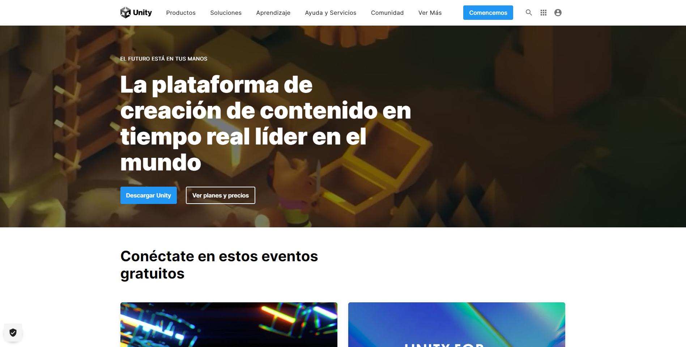

Aquí, tendremos la oportunidad de seguir explorando qué es Unity, sus servicios, licencias, juegos desarrollados y acercamientos a distintas industrias. De la página nos interesa llegar a la opción para descargar Unity.

[unity download](https://unity.com/es/download)

En la misma página, Unity nos indica cuáles deben ser nuestros primeros pasos, los cuales vamos a seguir y a explorar en este curso.

Al dar clic en el botón de descarga vamos a descargar el instalador para Unity Hub el navegador nos indicará que se encuentra completamente descargado, solo debemos ejecutar el programa.

Si te preguntas ¿por qué instalar Unity Hub y no solo el editor de Unity?

Bueno, hace algunos años ni siquiera existía el programa de Unity Hub, pero pronto se dieron cuenta de que era algo necesario, debido a que Unity actualiza su editor de forma constante y nuevas versiones salen al mercado; esto es relevante porque, por norma, cuando se comienza un proyecto, debe mantener siempre su versión del editor con la que se desarrolló, porque entre una versión y otra del editor se agregan nuevas funciones, mientras que otras son eliminadas. Si actualizamos nuestro editor cada vez que hay una nueva versión, seguramente hay proyectos que quedarían inservibles, lo que no es una opción, y mucho menos para proyectos cuya ejecución tarda años.

Unity tiene un proceso, en el cual puede convertir un proyecto de una versión vieja a una nueva; sin embargo, este proceso puede llegar a ser muy tardado, requerir un gran poder de cómputo y no quedar bien.

Así que para resolver el problema se creó Unity Hub, una herramienta con la que puedes tener en tu equipo varias versiones de Unity y, a su vez, puedes tener varios proyectos, cada uno con su propia versión del editor, con lo cual se deja de lado la tarea de hacer una gestión manual.

La instalación del editor es muy sencilla, basta con seguir los pasos del instalador y pronto tendremos nuestro programa instalado.

>\* La versión de Unity Hub no es estrictamente relevante, lo único que cambia es la cantidad de funciones de gestión disponibles, pero no altera los proyectos.

Una vez que tenemos el programa abierto, se verá como se observa a continuación:

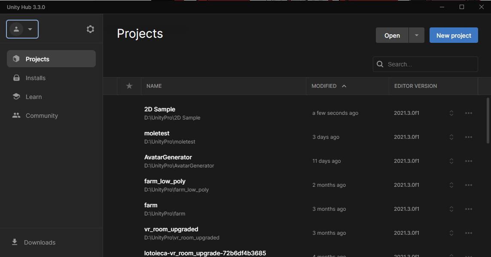

Si se ignora el listado de proyectos que depende de cada uno, podremos ver una interfaz como la mostrada.

Antes de explicar qué hay en cada segmento de la interfaz, los invito a que agreguen su usuario, para que Unity pueda validar su licencia y no les ponga ninguna restricción al trabajar.

Para realizar este proceso, puedes iniciarlo desde Unity Hub, dando clic en el ícono de usuario y seleccionando la opción de crear cuenta (create account), lo cual te llevará directamente a donde debes crear su cuenta y seleccionar tu licencia. Puedes elegir una licencia de tipo personal, que te dará acceso gratuito a la herramienta sin periodos de prueba.

Una vez terminado su registro pueden volver a Unity Hub y seleccionar la opción de iniciar sesión (Sign in), llenar nuestros datos y ver como el icono de usuario cambia por uno personalizado, indicandonos cual es nuestra cuenta vinculada.

La cuenta que acabas de crear es importante porque Unity liga sus servicios a las cuentas. Si realizas compras en su tienda de assets (lo veremos más adelante), si avanzas en la plataforma de aprendizaje de Unity, certificaciones, servicios en la nube, regalías de anuncios, entre otras cosas, se ligan a la cuenta, así que es cosa seria.

Ahora sí vamos a explicar qué opciones tenemos en el programa de Unity Hub.

Opciones de Unity Hub
-------------------

Nos podemos dar cuenta inmediatamente de que Unity no tiene 100 % de su material traducido, por lo que es muy frecuente encontrar documentación y opciones en inglés. Todo el curso se dará en español, pero es altamente recomendable. para mejorar su experiencia. aprender inglés.

Projects (proyectos)
-------------------
En el apartado de proyectos es justamente donde vamos a gestionar nuestros proyectos, ya sean juegos, interactivos o aquellos que estén planteados para una plataforma u otra. Todos se concentran aquí, y lo más relevante para Unity Hub es guardar la relación sobre qué versión del editor está configurada para cada uno de los proyectos.

En este mismo espacio podemos crear nuevos proyectos, así como abrirlos, en caso de que los tengamos en el equipo pero no se encuentren en la lista. También podemos eliminar nuestros proyectos. Recuerda siempre tener un respaldo antes de borrar cualquier cosa. Y, por si tenías la duda, también hay que tener un respaldo antes de convertir un proyecto de una versión a otra; Unity siempre nos recordará de hacer esto, pero nos conviene que seamos nosotros quienes tengamos ese cuidado.

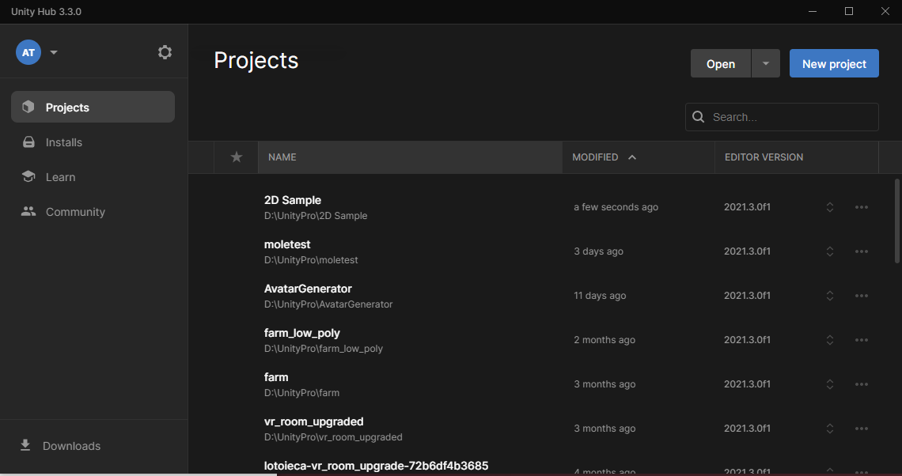

Installs (instalaciones)
-------------------
En la sección de instalaciones, vamos a ver una lista de las diferentes versiones del editor que tenemos; de inicio, debe estar vacía, pero conforme vayamos trabajando se deben agregar los editores.

Todavía no instalamos nuestro editor, pero es importante comentar, para aquellos que van a empezar a instalar el editor antes de seguir leyendo esto, que la versión que usaremos en el curso es la siguiente:

**2021.3.11F1**

Es importante saber que esta versión está marcada como LTS, que significa long term support, es decir, que tendrá respaldo del equipo de Unity para arreglar problemas de estabilidad y segurida, por un largo periodo de tiempo, ya que hay proyectos que duran años. Esto es muy importante.

También cabe resaltar que los últimos dígitos, que en este caso son 11F1, pueden ir cambiando según las actualizaciones de esta versión, pero siempre será 2021.3 y debe indicarse cómo LTS.

Learn (Aprendizaje)
-------------------
El tercer apartado disponible en Unity Hub es una sección dedicada al aprendizaje, en la que encontramos proyectos y artículos de Unity que nos ayudarán a aprender nuevos conceptos. Unity ofrece muchos recursos de este tipo, porque para Unity es muy importante que su comunidad pueda ver las nuevas características y aprenda a utilizarlas. La mayoría del contenido, como lo comentamos anteriormente, está en inglés y tratan de mantenerlo al día, pero hay algunos temas que yo mismo he visto y se tienen que hacer adaptaciones al editor más actual.

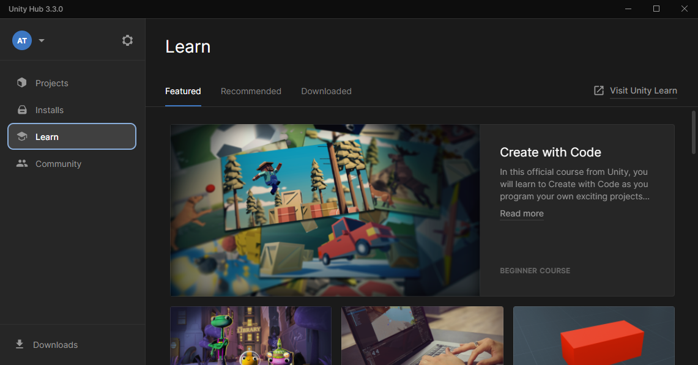

Los invito a que dejen que su curiosidad los invada y prueben algunos de estos materiales, sobre todo los llamados microproyectos, que son juegos que vienen codificados parcialmente y en los que Unity te va llevando de la mano para explicarte cómo realizar ciertos cambios. Estos representan una gran forma de aprender, aunque pueden ser abrumadores si no se conocen aún la interfaz y los conceptos básicos. Pero no te preocupes, porque estamos aquí para hacer que este primer acercamiento sea suave y que no te pierdas ningún detalle en el camino.

Community (comunidad)
-------------------
El apartado final de Unity Hub es la sección de comunidad, como lo decíamos anteriormente, que es uno de los puntos más fuertes de Unity. Tiene una gran comunidad, y aquí mismo Unity nos provee de los accesos a los sitios más importantes, como es:

*   El blog donde hablan de eventos, noticias, anuncios de nuevas características, etcétera.
*   Preguntas y respuestas, donde hay quienes hacen preguntas técnicas sobre el editor, soluciones o su código, y hay quienes son expertos, responden las preguntas y ganan puntos.

Estoy seguro de que, como yo, encontrarás un gran aliado en el foro. Cuanto más avances, más te darás cuenta de que hay personas que ya pasaron por este mismo camino, y su experiencia nos ayudará a encontrar las mejores soluciones a lo que sea que busquemos.

Instalación
-------------------
Ahora sí, la hora ha llegado, vamos a instalar nuestro editor, que es donde realmente vamos a trabajar.

Para ello, vamos a seleccionar la sección de Instalaciones (Installs) y a dar clic en el botón de Instalar editor (Install editor).

Esto nos mostrará un listado de las versiones de Unity disponibles; vamos a seleccionar la versión 2021.3.11f1 LTS.

Una vez que damos clic en instalar (Install), vamos a ver un listado de opciones y características extra que tiene el editor para ver cuáles queremos descargar; no les recomiendo seleccionar todas, porque es una carga muy pesada para el equipo, sobre todo si tienen poco espacio en su disco duro. Solo hay que seleccionar lo que necesitamos. Siempre podemos volver a la sección de instalaciones y pedir que se descarguen más complementos para otras plataformas, de manera que no es algo crítico.

Para este módulo y la mayoría de los siguientes, vamos a necesitar solo las herramientas para compilar en PC, de manera que solo necesitas descargar el editor Microsoft Visual Studio Community 2019. Aquí aparece que ya está instalado porque ya tengo otras versiones de Unity con este programa instalado.

Afortunadamente Unity Hub ya hace este chequeo; anteriormente te instalaba Visual Studio tantas veces como versiones del editor tuvieras.

\*Una recomendación personal es que puedes instalar el editor en un disco de estado sólido para que sea más rápido de cargar y que los proyectos, que también pueden ser muy grandes y pesados, los tengas en otro disco donde tengas mayor capacidad de espacio. Hay una forma de ingresar a las configuraciones de Unity para indicarle el directorio donde van a crear los proyectos; te recomiendo que hagas una carpeta especial y, así, tengas el control completo en una sola ubicación.

Una vez iniciado el proceso de instalación, veremos cómo Unity Hub gestiona las descargas:

Esperaremos un momento a que se realice la descarga y a continuación podremos crear proyectos.

Para crear nuestro primer proyecto, vamos a ir al apartado de proyectos y dar clic en el botón de Nuevo proyecto.

A continuación nos saldrá un listado de los tipos de proyecto que podemos crear. Todos estos son preconfiguraciones que podemos tomar como punto de partida; algunos de ellos inclusive son ejemplos completos listos, solo para darles play. En este caso, vamos a empezar con algo básico, que es crear un proyecto en 2D. Debemos agregar también el nombre del proyecto. Cabe resaltar que la versión de Unity la podemos seleccionar en esta misma ventana; de manera automática nos mostrará siempre la más nueva.

Unity comenzará a trabajar inmediatamente en la creación de nuestro proyecto; lo agregará al directorio que tengamos predefinido y nos mostrará la pantalla de carga. Este proceso requiere poder de cómputo y puede tardar desde un instante hasta varios minutos.

Unos pocos minutos después… o tal vez horas, vamos a ver nuestra pantalla principal, donde vamos a trabajar.

Como digna introducción de Final fantasy o Dragon quest, después de horas de estar en el proceso, este es nuestro punto de partida.

Interfaz del editor  
-------------------

Unity es una herramienta poderosa, y como diría el buen tío Ben (de la película Spider Man): “Un gran poder, conlleva una gran responsabilidad”; sin embargo, antes de todo, necesitamos saber cómo se usa este poder.

El editor de Unity es muy extenso, tanto que hay muchas funciones que están escondidas, hasta que las mandamos llamar; pero no hablemos de eso. En su lugar, vamos a descubrir qué es lo que tenemos ante nosotros.

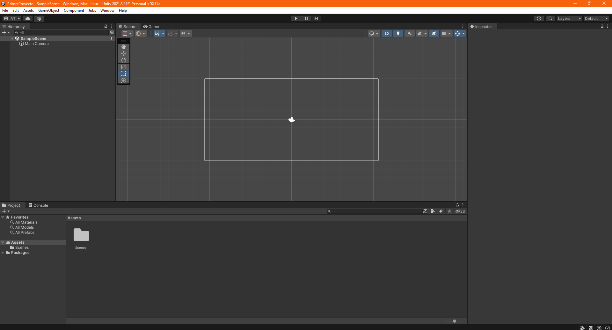

Esta primera pantalla de un proyecto en blanco es nuestro punto de partida. Antes que nada, vamos a observar cómo cada sección se encuentra identificada con una etiqueta en su parte superior izquierda, donde podemos leer el nombre de cada sección.

Cada uno de estos elementos son llamados paneles o ventanas, en cada uno de estos vamos a encontrar diferentes configuraciones que nos van a ayudar a lograr lo que deseamos, vamos a tratar de no perder la cabeza de momento y vamos a ver una pequeña funcionalidad antes de cualquier cosa.

Una funcionalidad que tiene Unity es la de poder configurar las ventanas de la forma que se nos acomode mejor, de manera que si estamos trabajando con una ventana que está escondida y casi no es visible, podemos traerla al frente o combinarla con otras, por ejemplo podemos poner la ventana de game a un lado de la ventana de escena, con un simple drag and drop.

De esta manera podemos generar un layout o acomodo personalizado. Unity conoce que hay ciertos acomodos que pueden ser mejores para cierto rol dentro de un desarrollo, es por eso que el acomodo puede ser una configuración que se guarde o que podemos seleccionar, de hecho ya existen opciones por defecto que podemos consultar en el apartado de layouts en la parte superior derecha del editor.

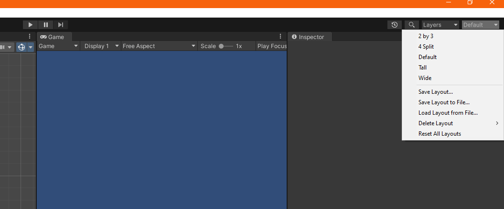

Sientanse con la libertad de probarlos todos, según vayamos trabajando, el curso se llevará a cabo en su mayoría con una configuración muy parecida a la DEFAULT, pero no es ningún problema la configuración siempre y cuando entendamos para qué es cada una de las ventanas.

Vamos a ver cual es la función de cada una de las ventanas con el ejemplo de la documentación de UNITY, misma que se puede consultar en:

[docs unity3d](https://docs.unity3d.com)

Aquí vemos un proyecto con más cosas pero que nos sirve perfectamente para identificar las diferentes ventanas con la configuración que muestra la mayoría de herramientas más útiles del día a día.

- A. Toolbar (barra de herramientas): es la parte superior, en la que podemos encontrar configuraciones como los botones de ejecución de play, pause y cuadro a cuadro; también tenemos a la derecha las opciones para cambiar de configuración de ventanas, un buscador global y un indicador de las capas visibles del proyecto. Esto último es una herramienta muy útil para megaproyectos.

- B. Hierarchy (jerarquía): esta ventana muestra un listado de todos los gameobject que existen en nuestra scene (este es un buen momento para consultar el “Glosario”). Está muy ligada a la ventana de scene, ya que una muestra los objetos en forma de una lista de texto, con los nombres, y la otra, la representación gráfica y visual final dentro del mundo que estamos creando.

- C. Game view (vista de juego): este panel es el que muestra una previsualización de cómo se verá el juego en su estado final; la diferencia entre game view y scene view es que en la scene se pueden modificar los elementos, mientras que en game view no podemos realizar ningún cambio.

- D. Scene view (escena): es la ventana donde más tiempo vamos a pasar; en esta vemos todos los elementos de nuestro juego y podemos interactuar con ellos, moverlos en el espacio, transformarlos, etcétera.

- E. Overlays (elementos sobrepuestos): estos no son visibles siempre, solo salen para ciertos componentes, como la cámara, que nos permite previsualizar qué es lo que están haciendo esos elementos en particular.

- F. Inspector window (inspector): esta ventana es de lo más útil; en ella vamos a ver el desglose de todos los components que tienen cargados nuestros gameobject. Cada component va a describir un comportamiento en específico de nuestros objetos.

- G. Project window (ventana de proyecto): es el equivalente a un explorador de archivos, como lo tenemos en nuestra computadora. Este se centra únicamente en los archivos de nuestro proyecto y es muy útil para interpretar tipos de archivos que solo tienen sentido en nuestro juego, como pueden ser materials, normal maps, prefabs, sprites, etcétera.

- H. Status bar (barra de estatus): es una sección muy pequeña que se vincula con la ventana de console, aunque no se muestra en la documentación inicial lo que hace console es mostrarnos mensajes del editor para identificar errores o datos informativos que nosotros mandamos.

En esencia eso hacen las diferentes ventanas visibles en el acomodo DEFAULT, sin embargo, para que nos quede más claro vamos a hacer un ejemplo muy sencillo de crear un elemento y ver cómo es que esto se reproduce en cada una de las ventanas.

Crear un GAMEOBJECT
-------------------

Primero que nada vamos a crear un objeto, hay varias formas de hacerlo, siendo una de las más sencilla el dar clic derecho mientras el cursor se encuentra dentro del área de la ventana de hierarchy. En el menú contextual que nos aparece vamos a elegir la opción de 2D object, luego vamos a indicar que vamos a crear un sprite y luego un triángulo.

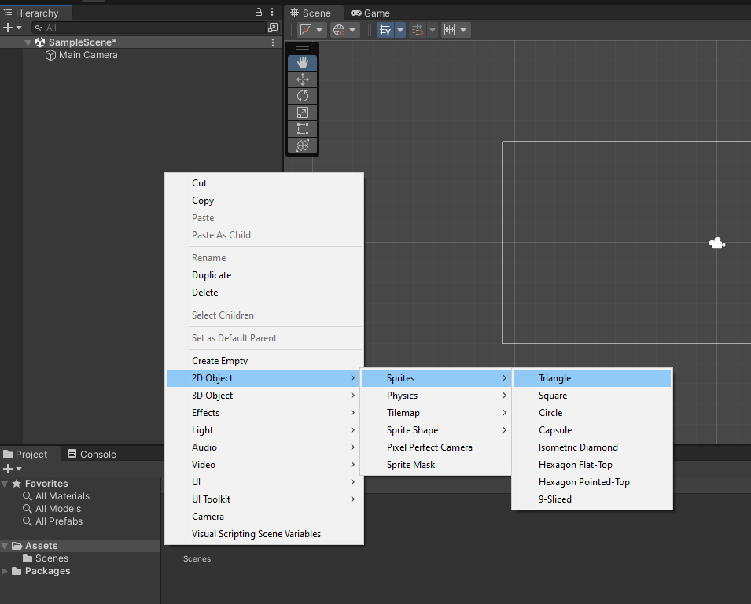

Una vez seleccionado vamos a ver que apareció en nuevo gameobject en la ventana de hierarchy y que también podemos ahora ver su representación visual en la ventana de scene.

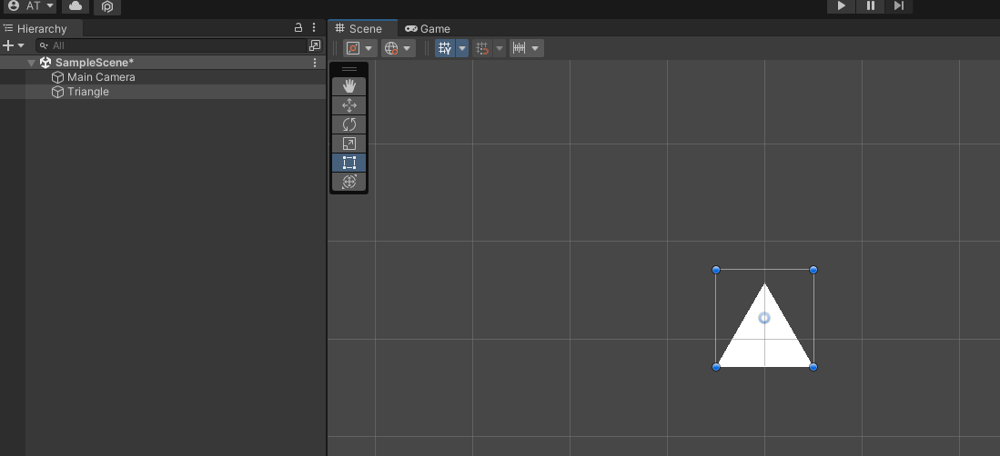

Observa que al dar click en el gameobject dentro de hierarchy se marca seleccionado, a diferencia de si seleccionamos por ejemplo el otro objeto que es la cámara (Objeto puesto por defecto). Al seleccionar los objetos en hierarchy se resaltan en la ventana scene.

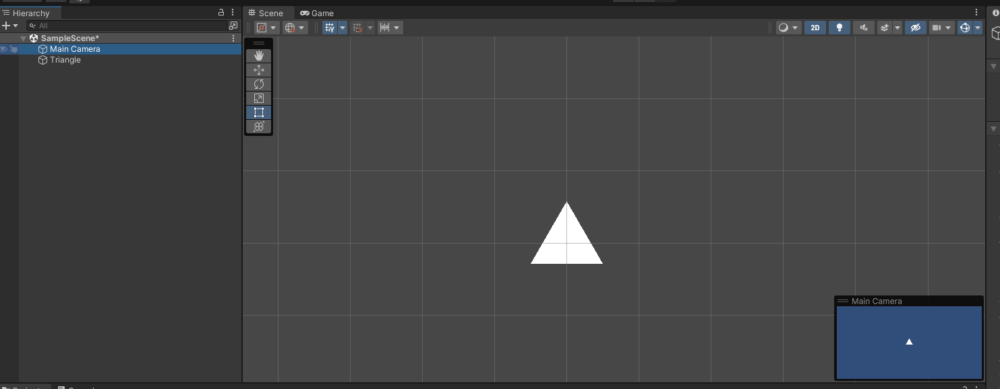

Y por si no lo observaron ya, también cambiar entre la selección de cada uno de ellos podemos ver todos sus atributos en la ventana inspector, esta ventana muestra siempre a detalle toda la información del objeto seleccionado.

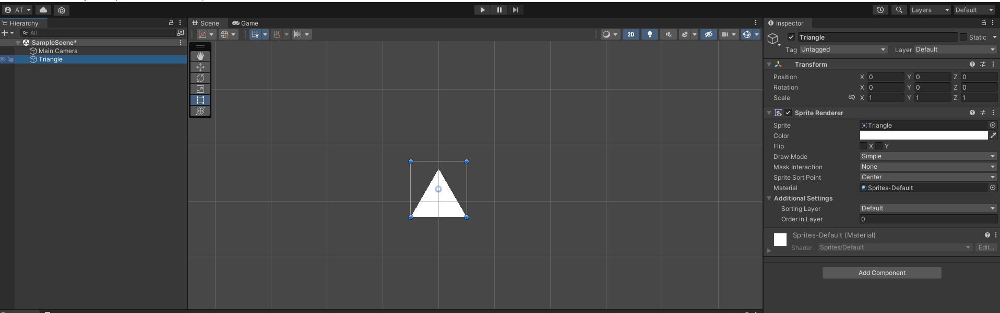

De esta forma vemos como claramente las 3 ventanas interactúan, mostrando los elementos que hay en la scene y sus propiedades.

En este momento podemos cambiar a la ventana de game para ver cómo es que se visualiza nuestro juego hasta el momento cabe resaltar que se ve exactamente igual que como se ve en la ventana scene si seleccionamos en la hierarchy el gameobject de Main Cámara, observando que en scene aparece un elemento sobrepuesto con la misma vista en miniatura.

Ahora para usar las otras dos ventanas vamos a tener que crear un componente, esto lo veremos en la siguiente sección.

Hasta este momento vamos a realizar dos ejercicios

1.  Realizar los movimientos necesarios para crear el siguiente layout en Unity

2.  Agregar a la escena 5 objetos e intentar moverlos de lugar

Componente TRANSFORM
-------------------

Ahora que sabemos cuales son las diferentes ventanas del editor vamos a ver dos componentes muy importantes y vamos a modificarlos para poder utilizar las dos ventanas que nos faltan tanto project como console.

Primero que nada debemos aclarar dos conceptos muy importantes, que es un gameobject y que es un componenet.

Para explicarlo mejor vamos a pensar primero en los gameobject como si estos fueran un plano para un robot, un plano que está vacío inicialmente, si quisiéramos un Robot que camine entonces a nuestro plano le agregaremos un component que describa la función de unas piernas caminando, si quisiéramos que saltara entonces agregaremos otro component que hiciera la tarea de salto y juntos los components del plano podrian hacer un robot que camina y salta.

Es así mismo como funcionan los gameobject, en Unity la unidad principal es este primer plano o cascarón en blanco de un gameobject y lo que lo convierte en un robot, un asesino o un guardián son los componentes que le vamos agregando.

Unity funciona sobre una idea fundamental que es, crear pequeñas funciones que en suma logren ejecutar todo un sistema complejo, de manera que un pequeño robot como Wall-e, puede evolucionar en un Transformer como Optimus Prime. Ambos nacen del mismo núcleo pero tienen diferentes componentes que alteran su funcionamiento.

En Unity cada gameobject se crea un componente que es universal, que se llama transform, este componente es indispensable para todos porque les ayuda a identificar en qué lugar de nuestra SCENE deben de aparecer.

El componente transform controla tres variables que son:

*   **Posición**: identifica un punto específico en un espacio tridimensional, se ubica mediante los ejes X,Y,Z. Para los juegos en 2D el eje Z es siempre 0
*   **Rotación**: indica si el objeto está girado en una cantidad de grados de 0 a 360, en los diferentes Ejes
*   **Escala**:  indica si el objeto está modificado en su escala, esta parte es muy importante ya que siempre la escala de 1 es la original, sin embargo al modificarlo de forma no uniforme puede causar efectos no esperados de distorsión.

Es importante observar que las variables del componente transform son divididas en 3 datos, aunque no entraremos en detalle de los tipos de datos, es buen momento para observar que estos 3 datos conforman un vector de dimensión 3.

Para hacer esto más sencillo vamos a ver un ejemplo, en este ejemplo creamos 3 triángulos y modificamos sus tamaños para formar una variación de la mitad y el doble del tamaño original.

1.  Creamos un 2D Object de tipo sprite en forma de triángulo
2.  En su componente transform lo ponemos en el origen
    1.  Las coordenadas Origen son (0,0,0) mejor conocido como vector origen
    2.  Para cambiar los datos podemos simplemente hacer clic y escribir el nuevo valor
    3.  También podemos cambiar entre los diferentes campos con la tecla tab
3.  Agregamos el segundo Sprite que debe ser el más pequeño
4.  Lo colocamos en -2.5 en x y 0 en y
5.  En este caso modificamos su escala de manera uniforme a 0.5 en todos los casos
    1.  Es importante resaltar que todos los valores que capturamos son manejados internamente como valores flotantes, es decir, con punto decimal.
6.  Finalmente creamos el tercer Sprite para ser el más grande
7.  Lo colocamos en el 2.5x y 0 en y
8.  Ahora duplicamos todos sus valores de escala para que sean iguales a 2

Con esto podemos ver la utilidad del componente transform.

Nombre de objetos y Emparentamiento
-------------------  

Existen varias formas de renombrar un gameobject, esto es una tarea muy común de manera que aquí expondremos todas las formas para que cada uno pueda elegir la que más se acomode a su forma de trabajo.

1.  Renombrar al crear objeto

    En cuanto creamos un objeto lo primero que podemos ver es que se selecciona el texto del nombre y justo en ese momento podemos escribir el nombre que queremos para el objeto, al dar enter o click en otro elemento se da por hecho que ya se terminó la edición.

2.  Renombrar desde el menú contextual

    Si damos click derecho sobre el objeto que deseamos editar, podremos ver la opción de RENAME con la cual podemos cambiar nuevamente en nombre, veremos como el nombre se selecciona y entra en modo edición. Igualmente al dar click en otro elemento o enter, la edición termina.

3.  Renombrar desde tecla especial F2

    Justo como lo podemos hacer en el explorador de archivos de windows, podemos también realizar un cambio de nombre del objeto presionando la tecla F2

    Muy importante, el cambio solo se puede realizar si seleccionamos un elemento con el cursor en la ventana de Hierarchy o de project.

4.  Renombrar con click sostenido

    Si seleccionamos el elemento en hierarchy y dejamos el click sostenido, al quitar el click podemos ver que el elemento entra en estado de edición para el nombre también.

5.  Editar nombre desde Inspector

    Así también es posible cambiar el nombre del Objeto desde la ventana inspector, en donde veremos el campo de nombre del objeto seleccionado en la parte superior, simplemente podemos escribir el nombre que deseemos y el mismo se cambiará automáticamente en hierarchy de la misma manera.

Es importante mencionar que se recomienda ampliamente tener cuidado con el nombre de los elementos y siempre ponerles un nombre descriptivo, debido a que nuestros proyectos conforme van creciendo, vamos a ir incrementando en gran medida la cantidad de objetos que existen.

Se recomienda ampliamente usar alguna convención como la [camelCase](https://www.google.com/url?q=https://es.wikipedia.org/wiki/Camel_case&sa=D&source=editors&ust=1667515660096334&usg=AOvVaw1OWZ9HaMxodql6T1-WsGEM) o la [snake\_case](https://www.google.com/url?q=https://en.wikipedia.org/wiki/Snake_case&sa=D&source=editors&ust=1667515660096906&usg=AOvVaw30tpxkZLcXtYk-sz7lmGfI) además de no usar carácteres especiales en la definición de nombres.

En Unity también existe un concepto que se llama emparentamiento que tiene diferentes usos, muchos de ellos los iremos explorando a lo largo del curso, sin embargo, en su forma más simple el emparentamiento indica una relación entre los dos componentes, se explicará mejor en el siguiente ejemplo.

A través del emparentamiento podemos hacer que un gameobject se convierta en Hijo de otro y esto ocasionará que el origen del objeto hijo ahora dependa del objeto padre lo que se llama local position, esto puede afectar de muchas formas pero la más visible es en su transform.

Navegación en la escena
-------------------

Por último y para terminar esta lectura seguramente te estarás preguntando algo muy común en este tipo de herramientas.

¿Cómo me puedo desplazar dentro de la escena?

Esto depende mucho de si estamos trabajando una escena 3D o 2D, comenzaremos con la más fácil que es la 2D.

En una escena 2D hay pocos movimientos que debemos perfeccionar.

1.  Desplazamiento por la Escena
    1.  Para desplazarnos basta con dar click derecho sobre cualquier espacio dentro de la ventana scene y esto cambiará nuestro cursor a uno de tipo mano que puede arrastrar o deslizar el espacio visible.

2.  Zoom
    1.  Para cambiar la cantidad de espacio que podemos visualizar es posible hacer scroll y esto aumentará o disminuirá el campo de visión, permitiéndonos ver a detalle un objeto o en su conjunto a varios de ellos.

3.  Ir a elemento seleccionado
    1.  Si damos dos clicks rápidos sobre un objeto en HIERARCHY este será mostrado directamente en la ventana scene como si hubiéramos pedido mostrarlo al centro.
    2.  Esto mismo funciona si seleccionamos uno o varios elementos de hierarchy y mientras están resaltados colocamos el cursor sobre la ventana scene y justo con esta combinación presionamos la tecla F, con esto. la ventana tratará de mostrar en el centro el o los elementos seleccionados.
4.  Mover objetos
    1.  Para mover los objetos de un lugar a otro, además de modificar su componente transform de forma manual podemos seleccionarlos en la ventana scene y dando un clic izquierdo sostenido podemos moverlos a donde queramos.
    2.  Nótese que al realizar este movimiento los valores del componente transform se modificarán en tiempo real y podremos ver como quedan finalmente.

Adicionalmente cabe la pena resaltar que existe el indicador de tipos de acción que podemos ejecutar, estos tendrán mucho más relevancia y utilidad cuando cambiamos al modo 3D.

Los diferentes tipos de movimiento por el orden en que aparecen en la barra de herramientas son:

Es posible cambiar entre ellos de forma rápida al tener el cursor dentro de la ventana scene y presionar la letra correspondiente a cada uno por ejemplo R para activar la herramienta de escalado.

Reto de la semana
-------------------

Para poner a prueba nuestros conocimientos básicos sobre el editor y los componentes vamos a realizar el siguiente ejercicio.

Instrucciones:

*   Crear un pequeño sistema solar con
    *   Sol (Centro)
    *   Mercurio
    *   Venus
    *   Tierra
        *   Luna
*   Vamos a crearlos y posicionarnos en una forma lógica en tamaño y distancia, como en el ejemplo se puede ver.
*   Hay que realizar el proceso de emparentamiento para lograr que al girar el sol en el eje Z se mueven todos los demás planetas.
*   Al girar el sol, la luna no gira alrededor de la tierra, ésta solo gira si giramos la tierra en el eje Z.

>\*Recuerda, para guardar tu trabajo solo tienes que ir a archivo guardar o presionar CTRL + S.

Rescatando lo importante
------------------- 

Realicemos un resumen sobre los temas visto en esta semana:

*   Repaso histórico sobre los primeros juegos y como se volvió importante tener herramientas de desarrollo para agilizar el desarrollo de videojuegos e interactivos.
*   Aprendimos sobre los motores de juego que hay en el mercado actualmente, cuales son sus características y diferencias. Sobre todo porque Unity es la mejor opción para comenzar nuestro aprendizaje.
*   Investigamos sobre los diferentes licenciamientos que ofrece cada motor, para poder tener un panorama más amplio de porqué se elige uno u otro en la industria.
*   Realizamos el proceso de instalación de Unity Hub y repasamos las opciones que podemos encontrar en él.
*   Instalamos el editor del curso que es la versión: 2021.3.11F1 LTS
*   Creamos nuestro primer proyecto.
*   Identificamos cuales son las diferentes ventanas que tiene Unity en su acomodo por automático.
*   Revisamos los conceptos básicos de gameobject, component, transform y parenting.
*   Identificamos y utilizamos las diferentes herramientas de transformación que nos da Unity para movernos y editar los elementos de cada scene.

Con esto cerramos la semana 1, en la siguiente semana vamos a estudiar otro componente de los más importantes, los Scripts, con ellos es posible describir la funcionalidad que queremos darle a cada gameobject, tienen un gran potencial y no tienen que ser muy complejos. Sigan ávidos de conocimiento, nos vemos la proxima semana y que la suerte esté siempre de su lado.